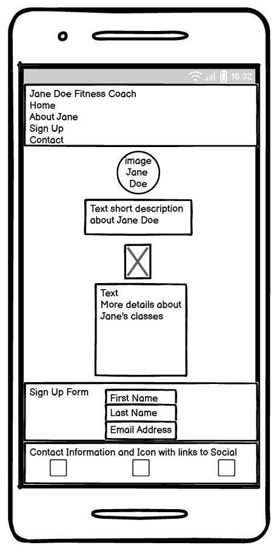
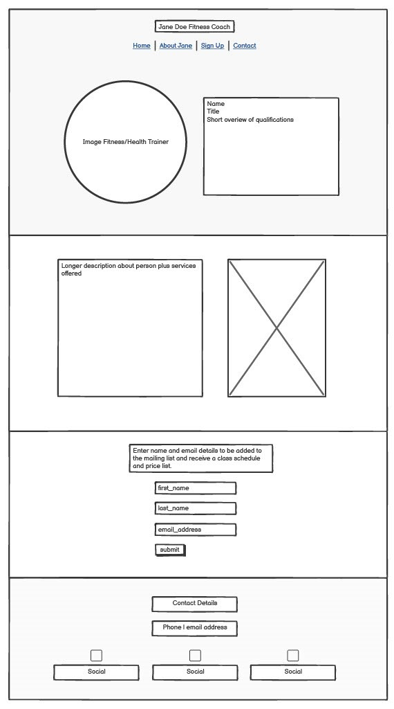
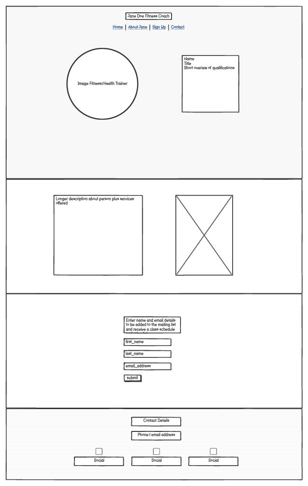

# Jane Doe Fitness Coach
Jane Doe Fitness Coach is the professional page for a person named Jane Doe and she is a Fitness Coach.  The site is targeted to pople in the Munich area that are looking for a peronal fitness coach or to join group classes that take place in the Munich area. For Jane Doe, the goal of the page is to collect email addresses so she can grow her email list.  This way she can send monthly updates to her email subscribers with her updated schedule and additional information about her classes. 
## Mockups
## UX

## Color Scheme
The color scheme for Jane Doe Fitness Coach is welcoming and on the soft side so that users of any age or sex will feel welcome at the site.
#4e4c4c is the background color for the header and footer
#ffffff is used for the navigation and links on the header and footer
#aad2db is used for the background color of the main section
#3a3a3a is used for paragraph text

## Typography
Jane Doe Fitness Coach uses one font, Montserrat, utilizing Montserrat bold for the heading text and Montserrat normal for the paragraph text.  
## User Stories 
### New Users
As a new user I would come to Jane Doe Fitness Coach either by a google search or a link from a gym or fitness center where Jane Doe is an instructor.  I want to find infomation about Jane's background as an instructor and I want to find out where, when and what she teaches. 
### Returning Users
Once a user signs up for Jane's mailing list there isn't really a reason to keep coming back to the site however in future, Jane may add a blog and the user may be enticed back to read her blog via an email from Jane.
## Wireframes
| Mobile Wireframe | Tablet Wireframe | Desktop Wireframe |
| ---------------- | ---------------- | ----------------- |
|  |  |  |
### Mobile
### Tablet
### Desktop
## Features
### Existing
### Future
## Tools and Technologies
## Testing
### Manual
### Validator Testing
## Unfixed Bugs
## Deployment
## Credits
### Content and Code
### Media
### Acknowlegements
