# Jane Doe Fitness Coach
Jane Doe Fitness Coach is the professional page for a person named Jane Doe and she is a Fitness Coach.  The site is targeted to pople in the Munich area that are looking for a peronal fitness coach or to join group classes that take place in the Munich area. For Jane Doe, the goal of the page is to collect email addresses so she can grow her email list.  This way she can send monthly updates to her email subscribers with her updated schedule and additional information about her classes. 
## Mockups

## UX
The goal of Jane Doe Fitness Coach is to add people to her email address list so more people know about her classes. It was designed to be easy to navigate and to provide users general information about Jane, and the opportunity to sign up for the email list ao they can be informed about her classes on a monthly basis.  The look is soft and simple so users are not intimidated and to convey Jane's personality and the idea that fitness is for everyone. The site is responsive, so it is easy to follow on all screen sizes.  

## Color Scheme
The color scheme for Jane Doe Fitness Coach is welcoming and on the soft side so that users of any age or sex will feel welcome at the site.
* #4e4c4c is the background color for the header and footer
* #ffffff is used for the navigation and links on the header and footer
* #aad2db is used for the background color of the main section
* #3a3a3a is used for paragraph text

## Typography
Jane Doe Fitness Coach uses one font, Montserrat, utilizing Montserrat bold for the heading text and Montserrat normal for the paragraph text.  
## User Stories 
### New Users
As a new user I would come to Jane Doe Fitness Coach either by a google search or a link from a gym or fitness center where Jane Doe is an instructor.  I want to find infomation about Jane's background as an instructor and I want to find out where, when and what she teaches. 
### Returning Users
Once a user signs up for Jane's mailing list there isn't really a reason to keep coming back to the site however in future, Jane may add a blog and the user may be enticed back to read her blog via an email from Jane.
## Wireframes
| Mobile Wireframe | Tablet Wireframe | Desktop Wireframe |
| ---------------- | ---------------- | ----------------- |
| 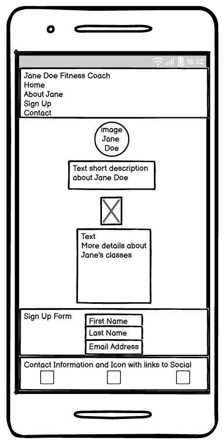 | 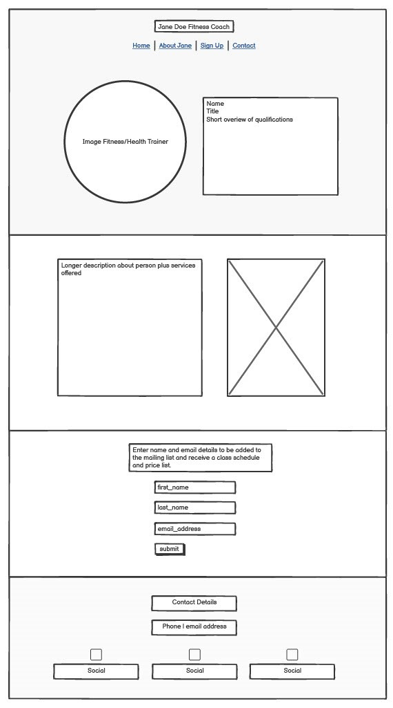 | 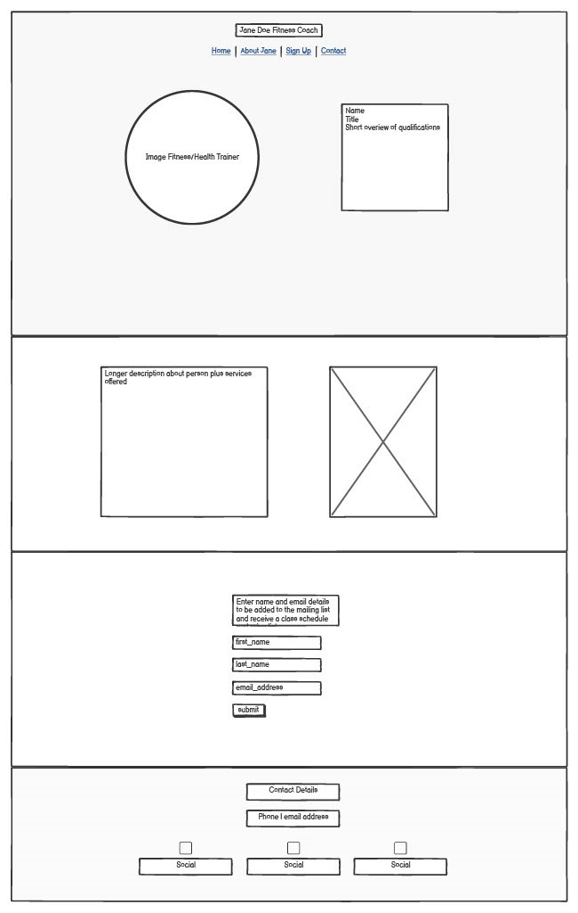 |
## Features
### Existing
| Feature | Description | Screenshot mobile | Screenshot larger screens |
|-------- | ----------- | ---------- | ---------- |
| Header and Navigation | The fully responsive navigation bar includes links to the Home, About Jane, Sign-Up and Contact sections of the one page site.  On mobile, the navigation is vertical on the left side of the screen and from screen sizes 576 and greater, it is centered on the page under title with extra space around each element. | 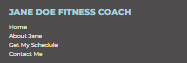 |  |
|Introduction of Main Section | The introduction section is designed with a headshot image of Jane and short description about her. It is designed to draw users in and not overwhelm with too much information at once. This section is fully responsve to look appealing on all screen sizes. | 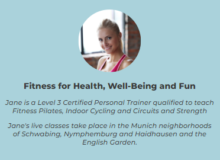 | 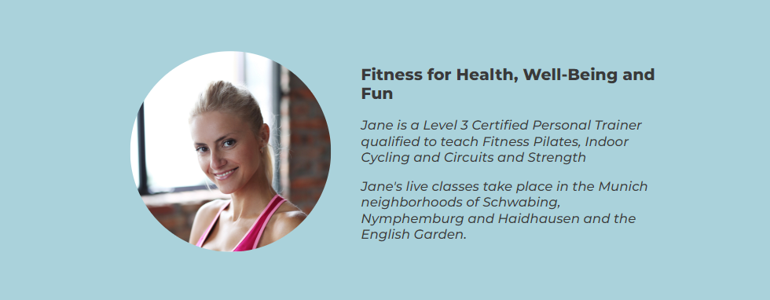 
| About Jane section | This section offers more information about Jane and the services that she provides as a fitness coach.  There is another image of Jane, this time training people. The background of this section is white, making the page visually appealing. The section is fully responsive, the image is quite small on mobile so the user can easily scroll to the information, on tablets and desktop, the image is bigger with the information placed on its left. | 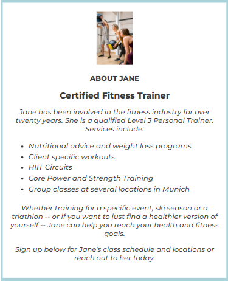 | 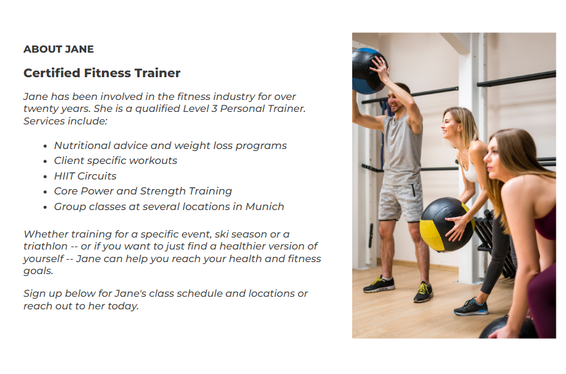 |
| Sign-Up Form section | This section has a sign-up form that users are asked to fill in their first name, last name and email address so they can join Jane's email list at Mailchimp.  Jane will then send once monthly emails with her updated schedule since it changes quite often. This section is responsive and is easy to read on all screen sizes. | 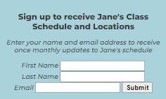 | 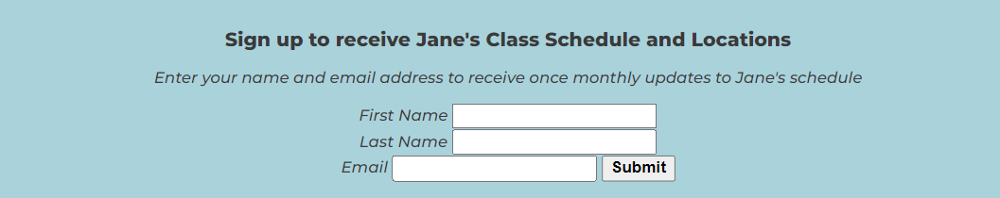 |
| Footer section | The footer section delivers contact information, phone, email address then icons with links to social networks. The color of the text and icons is white against the dark gray background, making it easy to see and aesthetically pleasing. This section is responsive and easy to read on all screen sizes. | 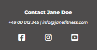 |  |
 Thank You Page | From the sign-up form, when users enter their name and email address and click on the submit button, they will go to a thank you page that opens in a new window so they don't have to click to go back to the original site. | 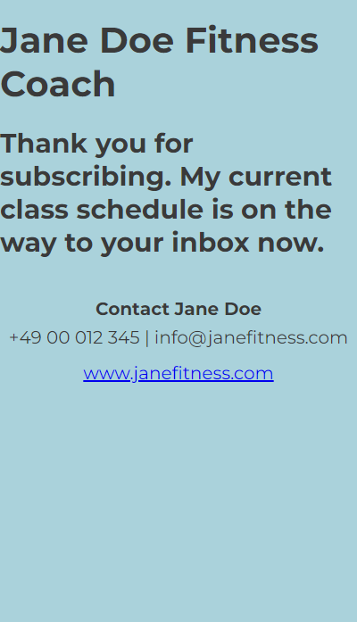 | 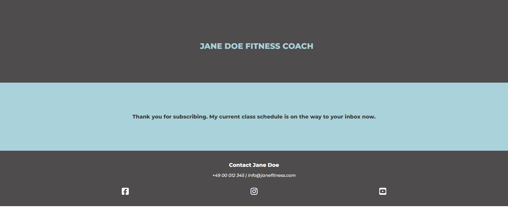 |  

### Future Features
Jane Doe Fitness Coach has room to grow and some future features that could enhance the site for both the organizer and the user are:
* Make the Header sticky so navigation will show when scrolling
* Gallery -- a gallery would give the users a better feel for what working out with Jane is really like and who attends her classes
* Details of different classes -- it would be helful for the users to be able to read about the different classes in case they are not familiar with them
* Blog -- a blog would give users a reasons to come back to the site again and again
* Post Current Schedule -- Jane Doe could post her current schedule on her website but this might discourage users from signing up to her email list

## Tools and Technologies Used

* HTML used for the main site
* CSS used to style the design of the main site
* CSS Flexbox used on the page layout and to create responsiveness over different screensizes
* Github used to store code online
* Gitpod used for IDE (develpment environment)
* FontAwesome.com used for social incons
* Canva.com used to create the favicon for Jane Doe Fitness Coach
* Google Fonts used to add Montserrat font to Jane Doe Fitness Coach

## Testing
### Manual
Manual testing was performed on these aspects of Jane Doe Fitness Coach
* Links - do the links deliver the user where they should?, do links to social networks open in a new window?
* Responsiveness - is the site visually pleasing on all screen sizes?
* Forms - do the forms function as planned?

### Validator Testing

## Unfixed Bugs

## Deployment

## Credits
The following are sources of information used in building Jane Doe Fitness Coach.

### Content, Code and Media
| Source | Location | Notes |
| ------ | -------- | ----- |
| [Freepik.com](https://www.freepik.com/free-photo/fitness-woman-workout_7135725.htm#fromView=search&page=1&position=50&uuid=dc72e9bc-7936-40af-8fe1-e4e2d880d947) | Intro section | Image |
| [Freepik.com](https://www.freepik.com/free-photo/women-working-out-with-trainer_6265274.htm#fromView=search&page=1&position=31&uuid=74944cf4-5462-46d6-a2be-f4b4b246a365) | About Jane section | Image |
| [Webdev Simplified](https://youtu.be/fYq5PXgSsbE?si=T-L7xfA9toAmR3PZ) | Main section | Flexbox |
| [CSS-Tricks](https://css-tricks.com/snippets/css/a-guide-to-flexbox/#aa-background) | Main Section | Flexbox |
| [Divya Thakur](https://www.youtube.com/watch?v=MCo1UtflJHM) | README | General How-To Information |
| [Github](https://docs.github.com/en/get-started/writing-on-github/getting-started-with-writing-and-formatting-on-github/basic-writing-and-formatting-syntax#links) | README | Basic Formatting Syntax |
| [Github](https://docs.github.com/en/get-started/writing-on-github/working-with-advanced-formatting/organizing-information-with-tables) | README | Organized Data with Tables |
| [Shay Howe](https://learn.shayhowe.com/html-css/writing-your-best-code/) | index.html and style.css | Coding Practices |
| Chris Quinn, Mentor | HTML | Smooth Scrolling and "defer" when putting a script in the head |

### Acknowledgements
